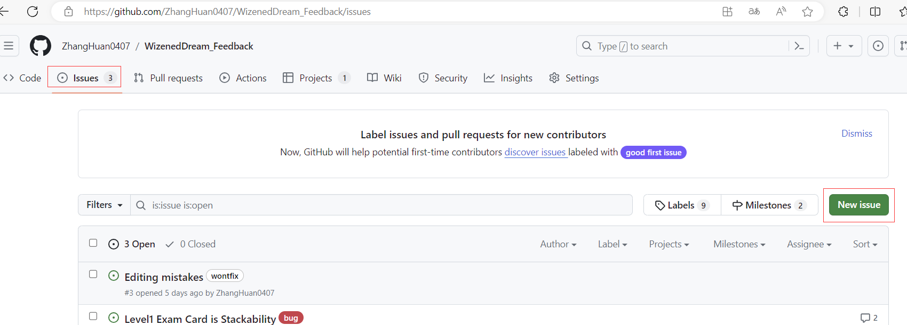

# Withered Dream
Withered Dream is a 2D story exploration game based on card stacking and limited-time operation. By modifying the stacking relationship between the cards, new cards can be generated and the story can be advanced. The game contains three stories: going to school, going to work, and being unemployed.

# Store
- [Demo](https://zhanghuan0407.github.io/WizenedDream_Feedback/WizenedDream/)
  - WebGL, no achievement, no saving
  - Version 0.3.36

- [Steam](https://store.steampowered.com/app/2640600/_/)
  - Windows 64 and MacOS(M1)
  - Version 0.3.36

- [Epic](https://store.epicgames.com/zh-CN/p/wizened-dream-ec61c3)
  - Windows 64 and MacOS(M1)

- [GooglePlay](https://play.google.com/store/apps/details?id=com.ZhangHuan.WizenedDream)
  - Android
  - Version 0.3.23

- [TapTap]()
  - Android, beta test
  - Version 0.3.26
  - The release was stopped because the cooperation process was too difficult

# Report Bug

# Discord
- https://discord.gg/hMXHymGC